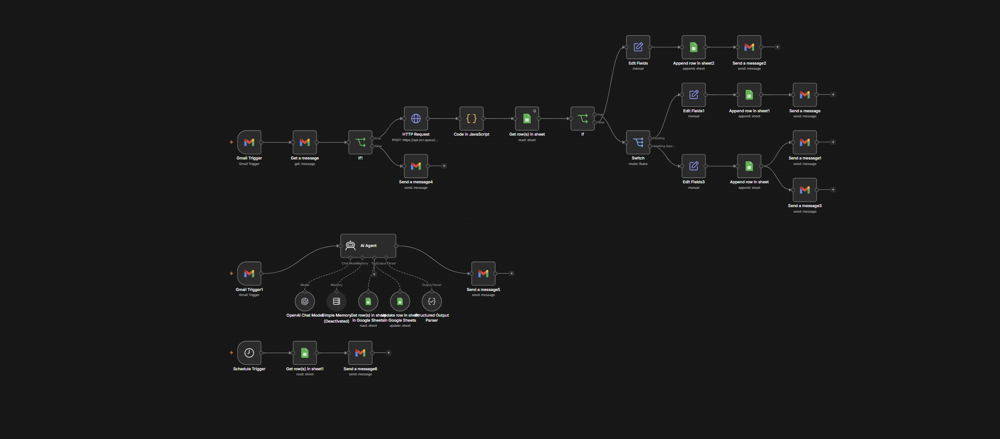

# Automated Expense Receipt Processing Agent

An end-to-end automation built in [n8n](https://n8n.io) that reads emailed expense receipts, extracts the relevant data via OCR, cross-references the employee's record, and routes the claim for auto-approval or manager sign-off — without anyone manually opening the email or typing numbers into a spreadsheet.

## Context

This was completed as a structured n8n training assignment during my internship at AAFAQ Advanced Solutions, using sample/test data (fake receipts, my own email as the test employee). It's a genuinely thorough hands-on exercise covering triggers, attachment handling, external API calls, conditional routing, and error handling in n8n — not a copy-paste template.

## Workflow diagram

## How it works

1. **Trigger** — A Gmail trigger watches for incoming emails with the subject line containing "Expense Claim."
2. **Extract** — The receipt attachment is downloaded and sent to the [OCR.space](https://ocr.space) API to extract raw text.
3. **Parse** — A Code node parses the OCR text to pull out the vendor, date, amount, and currency.
4. **Look up** — The employee's record (and their manager / auto-approve spending limit) is looked up in a Google Sheet by matching the sender's email.
5. **Route** — A Switch node compares the claim amount to the employee's auto-approve limit:
   - Under the limit → auto-approved, logged, and confirmed by email
   - Over the limit → routed to the manager for approval
   - Sender not found → flagged "Needs Review" with a note
6. **Log & notify** — Every outcome is appended to a spreadsheet and triggers an email notification to the relevant person.

## Stack

- **n8n** — workflow orchestration, Gmail trigger, Switch/If routing
- **OCR.space API** — receipt text extraction
- **Google Sheets** — employee/manager lookup table and claim log
- **Gmail API** — trigger and notifications
- **Custom JS (n8n Code nodes)** — OCR text parsing (vendor/date/amount extraction)

## Note on the exported workflow

The `.json` export in this repo has all credentials and personal document IDs redacted/replaced with placeholders — n8n workflow exports don't include actual credential values, but any hardcoded values (like the OCR API key) have been swapped out. To run this yourself, you'd need your own OCR.space API key and a Google Sheet matching the `Manager_Lookup` structure referenced in the workflow.
